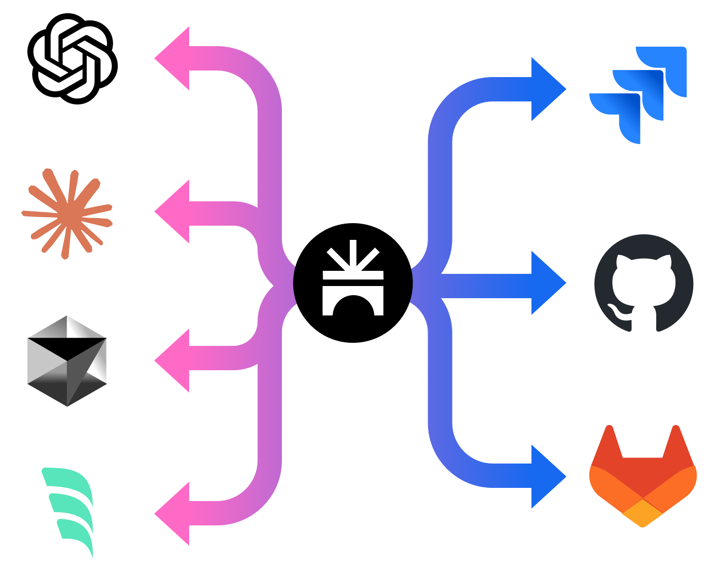

# SpaceBridge-MCP

A Model Context Protocol (MCP) server that integrates with the SpaceBridge REST API (https://spacebridge.io/docs) to automate issue management across connected issue trackers.



## Overview

SpaceBridge-MCP is a Model Context Protocol (MCP) server designed to integrate AI development tools (like Claude code, Windsurf, Cursor) with the SpaceBridge issue aggregation platform. It allows developers to interact with their issue trackers directly from their coding environment via their AI assistant.

**Core Benefits:**

*   **Reduced Context Switching:** Manage issues (search, create, view) without leaving the development environment.
*   **Automated Issue Tracking:** Facilitates workflows where AI assistants can automatically find or create relevant issues associated with code changes (e.g., for commit messages).
*   **Enhanced AI Context:** Provides AI assistants with access to issue details (via `get_issue_by_id`), enabling more context-aware code generation and analysis.
*   **Centralized Interaction:** Leverages SpaceBridge to interact with multiple underlying issue trackers (Jira, GitHub Issues, etc.) through a single interface.

**Functionality:**

The server exposes MCP tools and resources that translate natural language requests from an AI assistant into SpaceBridge API calls. Key features include intelligent duplicate checking (using similarity search and LLM comparison) before issue creation and flexible handling of organization/project context.

## Features

*   **Resource:** `get_issue_by_id`: Retrieves details for a specific issue using its SpaceBridge ID.
*   **Tool:** `search_issues`: Searches for issues based on a query string using either full-text or similarity search.
*   **Tool:** `create_issue`: Creates a new issue. Before creation, it performs a similarity search for potentially duplicate issues and uses an LLM to compare the top results against the new issue's content. If a likely duplicate is found, it returns the existing issue's ID; otherwise, it creates the new issue.
*   **Tool:** `update_issue`: Updates an existing issue.

## Getting Started

### Prerequisites

*   Python 3.9+
*   pip (Python package installer)
*   Access to a SpaceBridge instance and API key.
*   OpenAI API Key (for the `create_issue` tool's duplicate check).

### Installation using pip

1.  Install the package:
    ```bash
    pip install spacebridge-mcp
    ```

### Installation from source

1.  Clone the repository:
    ```bash
    git clone <repository-url>
    cd spacebridge-mcp
    ```
2.  Create and activate a virtual environment (recommended):
    ```bash
    # Use .venv as requested by user
    python -m venv .venv
    source .venv/bin/activate  # On Windows use `.venv\Scripts\activate`
    ```
3.  Install the package in editable mode, including development dependencies (for testing):
    ```bash
    # Use the specific python from your virtual env if 'pip' isn't found directly
    .venv/bin/python -m pip install -e ".[dev]"
    # Or if 'pip' is correctly on PATH for the venv:
    # pip install -e ".[dev]"
    ```
    *Note: This installs the package such that changes to the source code are immediately reflected without reinstalling. Including `[dev]` installs packages needed for running tests, like `pytest` and `respx`.*

### Configuration

The server requires the following configuration values:

*   **Required:**
    *   `SPACEBRIDGE_API_KEY`: Your API key for authenticating with SpaceBridge.
*   **Optional (Configuration & Context):**
    *   `SPACEBRIDGE_ORG_NAME`: Explicitly sets the organization context. (Optional).
    *   `SPACEBRIDGE_PROJECT_NAME`: Explicitly sets the project context. (Optional).
*   **Optional (Duplicate Detection Behavior):**
    *   `OPENAI_API_KEY`: Your OpenAI API key. *Required* if you want to use OpenAI for duplicate checking. If not provided, the server falls back to threshold-based checking.
    *   `DUPLICATE_SIMILARITY_THRESHOLD`: Sets the similarity score threshold (0.0 to 1.0) used for duplicate detection when `OPENAI_API_KEY` is *not* provided. (Default: `0.75`).
    *   `OPENAI_API_BASE`: Specifies a custom base URL for the OpenAI API (e.g., for local models or other providers). (Used only if `OPENAI_API_KEY` is set).
    *   `OPENAI_MODEL`: Specifies the OpenAI model name to use for duplicate checks. (Default: `gpt-4o`). (Used only if `OPENAI_API_KEY` is set).

These values, along with organization/project context, can be provided in multiple ways. The server determines the final values based on the following order of precedence (highest first):

1.  **Command-line Arguments:** Pass arguments when running the server. These override all other methods.
    ```bash
    spacebridge-mcp-server \
      --spacebridge-api-key "YOUR_SB_KEY" \
      --openai-api-key "YOUR_OPENAI_KEY" \
      --org-name "YOUR_ORG" \        # Explicit Org Name
      --project-name "YOUR_PROJECT"  # Explicit Project Name
      # --project-dir "/path/to/your/project" # Optional: Specify dir for Git detection
    ```
    *(Use `spacebridge-mcp-server --help` to see all available arguments.)*

2.  **Environment Variables:** Set standard environment variables. These override `.env` files and Git detection.
    ```bash
    # Example setting required and some optional vars
    export SPACEBRIDGE_API_KEY="YOUR_SB_KEY"
    export OPENAI_API_KEY="YOUR_OPENAI_KEY" # If using OpenAI duplicate check
    export SPACEBRIDGE_ORG_NAME="YOUR_ORG"
    export SPACEBRIDGE_PROJECT_NAME="YOUR_PROJECT"
    # Then run:
    spacebridge-mcp-server
    ```

3.  **.env File:** Create a file named `.env` in the directory where you run the server. Environment variables and command-line arguments override values in this file.
    ```dotenv
    # .env file content
    SPACEBRIDGE_API_KEY="YOUR_SB_KEY"
    OPENAI_API_KEY="YOUR_OPENAI_KEY"
    SPACEBRIDGE_ORG_NAME="YOUR_ORG"
    SPACEBRIDGE_PROJECT_NAME="YOUR_PROJECT"
    ```
    The server automatically loads values from this file if it exists.

4.  **Git Configuration Detection:** If organization and project are not set via arguments or environment variables, the server attempts to detect them from the `.git/config` file.
    *   It first checks in the directory specified by the `--project-dir` argument (if provided).
    *   If `--project-dir` is not used, it checks the current working directory where the server was started.

**Context Handling Priority:**

The organization and project context used for API calls is determined as follows:

1.  **Startup Context:** The context determined during server startup (using the precedence above: Args > Env Vars > Git Detection) is used by default.
2.  **Tool Parameter Fallback:** If (and only if) the server could *not* determine the context during startup (e.g., no explicit config provided and not running in a Git repository), the optional `org_name` and `project_name` parameters provided in a tool call (`search_issues`, `create_issue`, `update_issue`) will be used as a fallback.

**Note on Client Configuration:** When configuring MCP clients like Claude code (see "Connecting MCP Clients" section), passing credentials or context via the client's `--env` flags effectively sets them as environment variables for the server process (Priority 2). This is the recommended way to provide explicit context in environments where Git detection might fail (like Windsurf or Cursor).

### Running the Server

Once installed and configured, you can run the server using the command defined in `pyproject.toml`:

```bash
spacebridge-mcp-server
```

The server will start listening for MCP connections via standard input/output (stdio) by default.

## Connecting MCP Clients

This server uses standard input/output (stdio) for communication. You need to configure your MCP client (e.g., Claude code, Windsurf, Cursor) to launch the `spacebridge-mcp-server` command and pass the required environment variables.

**Configuration Steps:**

1.  **Install:** Ensure `spacebridge-mcp` is installed (see Installation section). The `spacebridge-mcp-server` command should be available in your environment's path (e.g., inside your virtual environment's `bin` directory if installed from source, or globally if installed via `pip install spacebridge-mcp`).
2.  **Find Server Path:** Determine the full path to the `spacebridge-mcp-server` executable. If you installed in a virtual environment `.venv`, it might be `/path/to/your/project/.venv/bin/spacebridge-mcp-server`. If installed globally, you can often find it with `which spacebridge-mcp-server` (Linux/macOS) or `where spacebridge-mcp-server` (Windows).
3.  **Add Server to Client:** Use your MCP client's command for adding a new server.

**Example using `claude mcp add` (Claude code):**

```bash
claude mcp add spacebridge \
  /full/path/to/your/spacebridge-mcp-server \
  --scope user \
  --env SPACEBRIDGE_API_KEY="your-spacebridge-api-key" \
  --env OPENAI_API_KEY="your-openai-api-key" \
```

*   Replace `/full/path/to/your/spacebridge-mcp-server` with the actual path found in step 2.
*   Replace the placeholder API URL and keys with your actual credentials.
*   `--scope user` makes the server available across all your projects in Claude code. Use `--scope project` to limit it to the current project.

**Other Clients (Windsurf, Cursor, etc.):**

Refer to the specific documentation for your client. The general principle is the same: provide a name for the server and the command to execute it, ensuring the necessary environment variables (`SPACEBRIDGE_API_KEY`, `OPENAI_API_KEY`, and optionally `SPACEBRIDGE_ORG_NAME`, `SPACEBRIDGE_PROJECT_NAME`) are passed to the command's environment. Some clients might have dedicated fields for environment variables, while others might require a wrapper script. Passing `SPACEBRIDGE_ORG_NAME` and `SPACEBRIDGE_PROJECT_NAME` is recommended for clients where the server's working directory might not match the actual project directory (e.g., Windsurf, Cursor).

## Usage Tips & Agentic Workflows

*   **Automated Commit Messages:** Configure your AI tool (e.g., via custom instructions or rules in Claude code, Windsurf, Cursor) to automatically reference relevant issue IDs when generating commit messages.
    *   *Example Rule/Instruction:* "When generating a commit message, always ask the SpaceBridge-MCP tool to find or create an issue related to the changes and include the resulting issue ID (e.g., `SB-123`) in the commit message footer."
    *   The AI can then use the `search_issues` or `create_issue` tool via this MCP server. If an issue exists, it gets the ID; if not, `create_issue` makes one and returns the new ID.
*   **Context Augmentation:** When asking your AI assistant to work on a feature or bug, provide the SpaceBridge issue ID. The assistant can then use the `get_issue_by_id` resource via this MCP server to fetch the full context (description, comments, status) directly from your tracker, leading to more informed code generation or analysis.
*   **Quick Issue Creation:** Simply ask your assistant "Create an issue about [brief description]" while coding. The `create_issue` tool will handle the similarity search and creation process.

## Development

### Running Tests

1.  Ensure you have installed the development dependencies:
    ```bash
    .venv/bin/python -m pip install -e ".[dev]"
    ```
2.  Run pytest from the project root directory:
    ```bash
    .venv/bin/python -m pytest -vvv
    ```

## Contributing

Contributions are welcome! Please follow these steps:

1.  **Find an Issue or Suggest an Idea:**
    *   Check the [GitHub Issues](https://github.com/spacecode-ai/SpaceBridge-MCP/issues) to see if your issue or idea is already being tracked.
    *   If not, open a new issue to discuss your proposed change or report a bug.

2.  **Fork the Repository:** Create your own fork of the project on GitHub.

3.  **Create a Branch:** Create a new branch in your fork for your changes:
    ```bash
    git checkout -b feature/your-feature-name
    ```

4.  **Set Up Development Environment:**
    *   Ensure you have Python 3.8+ installed.
    *   Create and activate a virtual environment (e.g., using `venv`):
        ```bash
        python -m venv .venv
        source .venv/bin/activate  # Linux/macOS
        # .\.venv\Scripts\activate # Windows
        ```
    *   Install the project with development dependencies:
        ```bash
        python -m pip install -e ".[dev]"
        ```

5.  **Make Your Changes:** Implement your feature or bug fix.

6.  **Run Tests:** Ensure all tests pass:
    ```bash
    python -m pytest -vvv
    ```

7.  **Lint and Format:** Ensure code style consistency (assuming Ruff is used, adjust if needed):
    ```bash
    ruff check . --fix
    ruff format .
    ```

8.  **Commit Your Changes:** Commit your changes with a clear and descriptive message.
    ```bash
    git commit -m "feat: Add feature X" # Or fix:, chore:, etc.
    ```

9.  **Push to Your Fork:**
    ```bash
    git push origin feature/your-feature-name
    ```

10. **Open a Pull Request:** Go to the original repository on GitHub and open a Pull Request from your fork's branch to the `main` branch of the original repository. Provide a clear description of your changes in the PR.

11. **Code Review:** Wait for maintainers to review your PR. Address any feedback provided.

## License

This project is licensed under the MIT License. See the [LICENSE](LICENSE) file for details.
